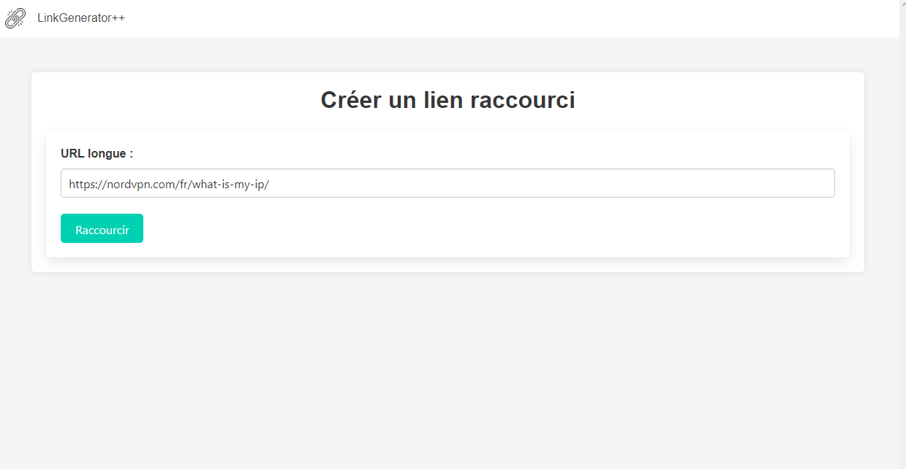
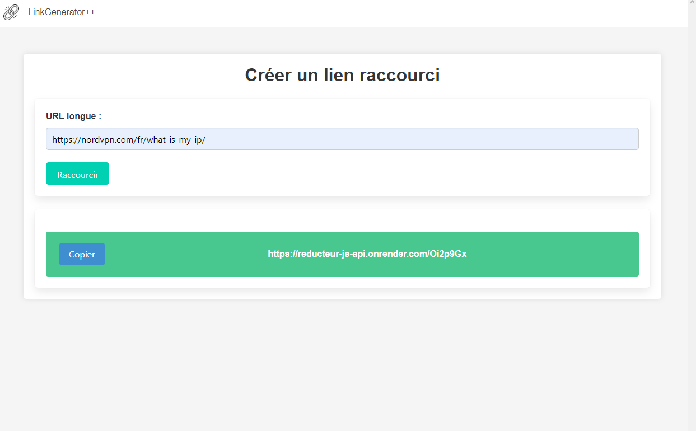

# DINAN_Olivier_CC4

# Mon Projet - Service de Raccourcissement d'URL

Bienvenue dans le projet de Service de Raccourcissement d'URL ! Je vais vous présenter une solution pour transformer de longues URL en liens courts et faciles à partager.

## Objectif

L'objectif principal du projet est de simplifier le partage d'URL en les raccourcissant de manière conviviale. Avez-vous déjà rencontré des liens complexes et encombrants qui sont difficiles à copier et à transmettre ? Ce programme permet de créer des URL raccourcies qui seront plus faciles à mémoriser et à partager sur les réseaux sociaux, par e-mail ou par d'autres moyens.

## Comment Ça Marche

Le programme fonctionne de manière simple :

1. Vous entrez une URL longue que vous souhaitez raccourcir sur le site [suivant](https://ephemeral-gaufre-dfc573.netlify.app).
2. L'API qui tournera en arrière plan génère automatiquement une URL courte unique.
3. Vous pouvez copier la nouvelle URL courte et la partager avec d'autres utilisateurs.
4. Lorsque quelqu'un clique sur l'URL raccourcie, il est redirigé vers la destination originale.

## Mode de Déploiement - Render

Render est simple et fcile d'utilité. Il permet de déployer rapidement l'API tout en garantissant une disponibilité optimale. (Pour l'instant)

### Gestion de Base de Données - SQLite

SQLite est un système de gestion de base de données relationnelle léger et efficace. Il est parfaitement adapté à notre application en raison de sa simplicité d'intégration et de son faible coût en ressources. D'autres alternatives sont:

- MongoDB (! Attention - risque de déconnexion de serveur pour maintenace)
- PostGreSQL
- Les fichiers json (lien réinitialisé à chaque démarrage)

SQLite dans le projet :

- Nous stockons les URL d'origine et les URL courtes associées dans une table SQLite.
- Nous utilisons des requêtes SQL simples pour insérer, mettre à jour et récupérer des données.
- SQLite nous permet de garantir la cohérence et la rapidité de l'accès aux informations sur les URL raccourcies.

## Captures d'écran
**Aperçu lien long**

**Aperçu lien court**

## Installation

Pour installer mon projet, suivez ces étapes simples :

1. Clonez ce [dépôt](https://github.com/Wink0NI/DINAN_Olivier_CC4.git).
2. Exécutez `npm install` pour installer les dépendances.
3. Exécutez `npm run start` pour démarrer l'application.

#### Modules Utilisés

Nous utilisons plusieurs modules JavaScript pour faciliter l'interaction entre le client et le serveur :

- **[axios](https://www.npmjs.com/package/axios) (v0.21.4) :** Pour effectuer des requêtes HTTP, notamment pour récupérer des informations sur les URL d'origine.
- **[cors](https://www.npmjs.com/package/cors) (v2.8.5) :** Pour gérer la politique de même origine (CORS) et permettre des requêtes HTTP depuis des domaines différents.
- **[express](https://www.npmjs.com/package/express) (v4.17.1) :** Pour créer un serveur HTTP qui gère les demandes d'accès aux URL raccourcies.
- **[nanoid](https://www.npmjs.com/package/nanoid) (v3.1.28) :** Pour générer des identifiants uniques pour les URL raccourcies.
- **[sqlite3](https://www.npmjs.com/package/sqlite3) (v5.1.6) :** Pour interagir avec la base de données SQLite et effectuer des opérations de stockage et de récupération de données.

## Liens d'accès au Projet

- Lien de redirection vers [l'onglet API (Render)](https://reducteur-js-api.onrender.com)
- Via [Netlify](https://ephemeral-gaufre-dfc573.netlify.app)
- De [Github Pages](https://wink0ni.github.io/DINAN_Olivier_CC4)
- Lien de téléchargement pour le [fichier HTML](https://github.com/Wink0NI/url_reductor_page.git)

## Auteur

- [Wink_0NI](https://github.com/Wink0NI)

## Licence

Ce projet est sous licence ISC.

